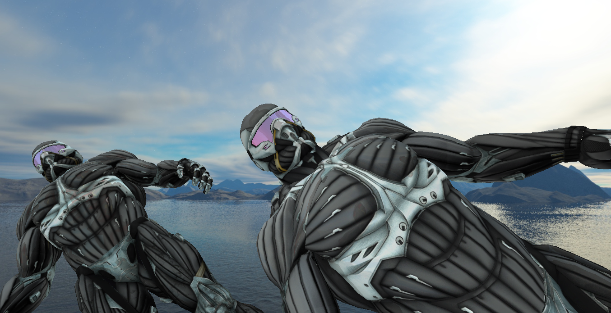
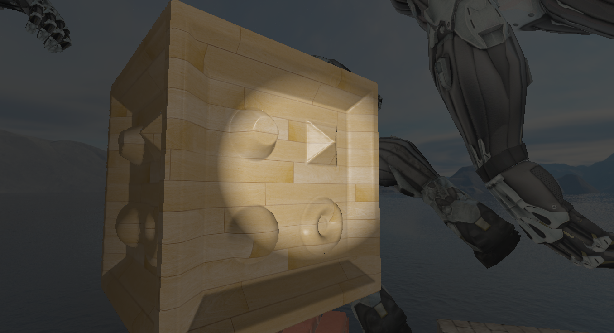

# MyOpenGLPortfolio

### Features

+ OpenGL 3.0+
+ Diffuse lighting
+ Specular lighting
+ Realtime reflections
+ Normal mapping
+ Parallax mapping 
+ Batch rendering 
+ Realtime reflections

# Running the executable
+ Download latest executable from the releases page.
+ The executable only works on windows.

# User Interface

### Keyboard
| Action | Keys |
|--------|------|
|Move Forward|<KBD>W</KBD>|
|Move Backwards|<KBD>S</KBD>|
|Move Left|<KBD>A</KBD>|
|Move Right|<KBD>D</KBD>|
|Move Up|<KBD>Space</KBD>|
|Move Down|<KBD>Shift</KBD>|

### Mouse

Use Mouse to navigate around.

# More Screenshots

